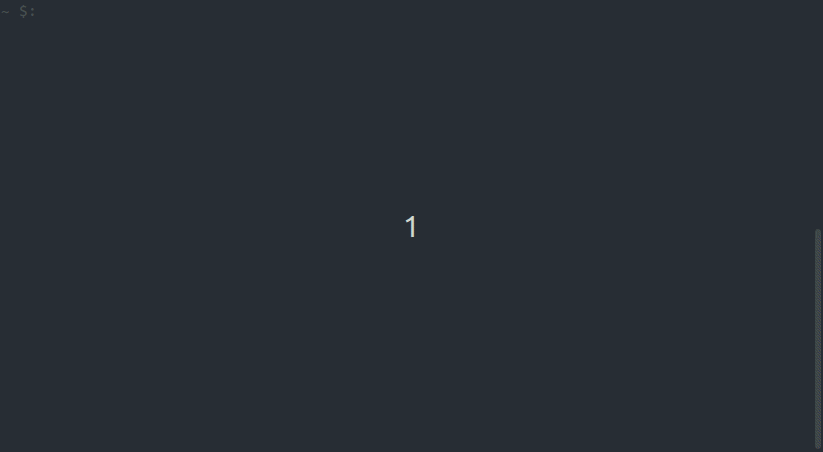

## computorv2

project of École 42 where it is necessary to implement an interpreter very similar to the bc command without using libraries that make it easier to work with complex numbers and matrices. the program supports basic math operations for `rational numbers`, `complex numbers`, `matrices`, `polynomial equations` and `functions`.



### how to use
```
python3 computorv2.py
```

additional options in interpreter:

`=?` for instant calculation

`*` and `**` for matrix multiplication. by term-to-term and matrices, respectively

`mod` to calculate the determinant in a matrix, to calculate the modulus of a complex number

`sin`, `cos`, `tan`, `rad` for trigonometric computation

`exit` exit from the program

`reset` clear command history and saved variables

`history` show command history with results

`variables` display a list of saved variables and their values


to run random tests:

```
python3 comp_tests/run_test_execution.py
python3 comp_tests/send_test_execution.py
```

the first program creates a socket on which it waits for expressions and executes when received

the second program sends a random expression for execution from prepared tests


